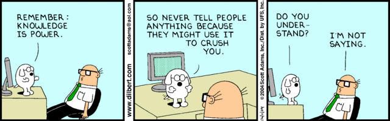

<!--- - "/Your Image Path/filename of image" : "comment" -->

As I approach the 11 month mark at my first full time job post-graduation, I am amassing my own wealth of knowledge.  I’m gaining  technical development skills and insight into the property and casualty insurance field, while also reflecting on what type of worker I am and what I find important for my own success within the workplace.  

I’ve learned that I highly value workplace diversity.  Homogenous teams do not provide the variety of thought I crave to stimulate my curiosity and further expand my knowledge. I value the existence of work-life balance as well as feeling connected to the team I am working with.  I do not believe the constant grind culture prevalent in millennial culture is conducive to happy or productive workers. 

Additionally, I see high worth in transparency; knowing who are my main points of contact, how I can manage my development goals, or what the procedures are to launch my career forward. I should be able to figure out what knowledge I need and where I can find it, however, this is not always the case. I thought the barriers I was facing regarding accessing information pertinent to my role was specific to me, but I quickly learned that this is a very real phenomena affecting many in the corporate world known as *“The Tribal Knowledge Trap.”*

## Tribal Knowledge: A Run Down

Tribal knowledge describes the wealth of knowledge that a company or group of people use to perform their routine tasks that eventually is **assumed common knowledge**, however **said information is not officially documented**, therefore the information is solely held in the minds of few individuals, or *‘The Tribe.’* *‘The Tribe’*  is most often comprised by those with particular specializations or veterans of the company, therefore they have had the time to amass their body of knowledge. 

### Frustrations 

The lack of documentation that I’ve come across is immensely frustrating.  As a developer coming onto projects utilizing proprietary technology, I am deeply reliant on proper and thorough documentation as I can no longer direct my questions to Google or Stack Overflow.  This lack of written rules and functionality for the product and service that is being provided is a hindrance for all parties involved: team members, the client, as well as the company providing their advice or services.  

* **Speaking as a team member**
  
     I’ve run into many roadblocks that stem from Tribal Knowledge and the lack of documentation.  Coming onto a new project, I need to be able to get up to speed as quickly as possible so I can be a productive and contributing member of my team.  If I only have one source I can utilize only containing sparse, high level information of the systems we’ve built which was last updated 6 months ago, the knowledge I am getting is out-of-date and incomplete.

    I am given tasks to complete and if I run into any problems or questions that aren’t documented in those initial resources, I then turn to my immediate team members.  Some times I am lucky and my first or second point of contact can help direct me or give me the information I am seeking, but more often than not, I run into a different scenario.  I am either told to reach out to someone else with that specialized knowledge or that there is no time available for them to assist because they still need to perform their duties to the team.  While I understand work still needs to be done, there should be time allocated to properly bring members up to speed. **If I am given the run around or the resources for an exhaustive on-boarding isn’t available, an alternative hub of information should be available** Without a reliable source of information, it is hard for me to provide the value I am capable of. 

* **From the client side**

    Once the team hired to implement the contracted solution leaves, the client must hope they are able to properly utilize and debug their system on their own. Their ability to do so is reliant on the proper training of client staff as well as the development of detailed documentation of the technological solution.  Without both present, the client can be left with a *'technically'* better solution, but not have the tools or ability to properly use it long term. In short, a lack of this amounts to a waste of time for all parties involved, as well as a waste of money for the client.  

* **From the eye of the consulting company**

    People can be invaluable assets to organizations. A company is only as strong as their workforce, but having knowledge hidden within the minds of people seems horribly inefficient. If people are relying on the practice that they have implemented for years and years, there is a high likelihood that the information is outdated. Humans aren’t perfect, which is why there are systems, procedures, and testing in place to help catch errors before they become detrimental to the system.  So why do companies rely on information sitting in someone’s mind to provide the service with no documentation or proper checking in place ensuring that steps were not missed?  My speculation: No one wants to spend the time and financial resources to retroactive fix something until it is an immediate problem, at which point, it's too late.

Companies across the board face potential problems when members of “The Tribe” leave the company.  Since documentation of knowledge was not happening in a progressive manner, a lot of valuable information is lost. 

### Navigating The Tribal Knowledge Trap

Now that we have been made aware of this phenomenon. So what? How do you combat and navigate your way through all the potential pitfalls of Tribal Knowledge in a large, international company?  For me, I've started tackling the issues **I** faced by creating my own documentation for the systems I was learning.  I collected the information I gathered from various team members and organized documents with descriptions, points of contact, and screenshots whenever it helped to clarify different points. I made sure to put them on public drives so if someone was seeking the same informatin, they would be able to reference my documentation in 2 minutes, versus the days it took me to collect and compile.  

I have no idea yet on how to combat this on a larger scale other than procedural redesign that include documentations as an integral deliverable from the get-go, but I don't think I have reached a place where I would know where to begin.  However, a few days ago a member of my alma mater, [Colton McCurdy](https://www.linkedin.com/in/mccurdycolton/)  made a post on LinkedIn that really resonated with me:  
> "Write code that is readable by anyone and make domain knowledge accessible (docs, diagrams, etc). Your goal should not be 'job security', but rather being able and free to move on to new challenges." 

I felt good knowing that I left a project having added value other people can benefit from, even though it most likely would be highly undervalued.  If it made my life easier, I am sure it will for others.
 

**TL;DR:** Tribal knowledge, or knowledge contained in the minds of individuals rather than documented in some fashion, is a huge hindrance.  Please, for the love of all that is good, please document your projects!

